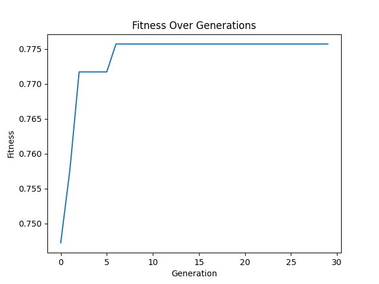
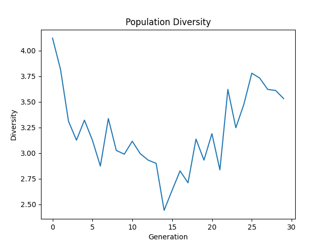
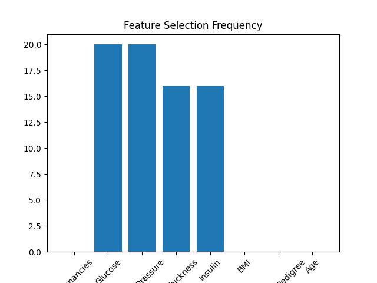

# 🧬 Genetic Algorithm — Feature Selection Dashboard

An interactive web app (Streamlit) that uses a **Genetic Algorithm (GA) built from scratch in Python** to automatically select the best subset of features in a dataset, maximizing the accuracy of a `RandomForest` classifier while reducing model complexity.

The project is configured by default on the **Pima Indians Diabetes Dataset**, but also supports any custom CSV uploaded by the user.



## ✨ Features

- **Interactive dashboard**: a "premium" dark-themed Streamlit UI to run and visualize the GA's evolution in real time.
- **Custom Genetic Algorithm**: a `GeneticAlgorithmFeatureSelection` class built entirely from scratch, with several interchangeable strategies:
  - **Selection**: `tournament`, `roulette`, `random`, `rank`
  - **Crossover**: `single`-point, `two`-point, `uniform`
  - **Mutation**: `bitflip`, `swap`, `inversion`
- **Live hyperparameter tuning**: population size, number of generations, mutation rate, and crossover rate via sidebar sliders.
- **Performance comparison**: baseline model accuracy (all features) vs. GA-optimized model.
- **Analytical visualizations**:
  - Fitness evolution (best individual + population average)
  - Population genetic diversity over generations
  - Feature selection frequency (GA stability across multiple runs)
  - Feature importance of the final model (Random Forest)
  - Trade-off between number of features and fitness (Pareto front)
  - Dynamics of the genetic operators (selection, crossover, mutation)
- **Custom dataset upload**: load your own CSV file and choose the target column.

## 📁 Project Structure

```
Mini_Projet_GA/
├── app.py                  # Streamlit application (UI + dashboard)
├── ga_pima_diabetes.py     # GeneticAlgorithmFeatureSelection class + GA logic
├── ga.ipynb                # Exploration / prototyping notebook
├── fitness.png             # Sample: fitness evolution curve
├── diversity.png           # Sample: population diversity
├── features.png            # Sample: feature importance
├── feature_frequency.png   # Sample: feature selection frequency
└── README.md
```

## 🚀 Getting Started

### Prerequisites

- Python 3.9+

### Dependencies

```bash
pip install streamlit pandas numpy matplotlib seaborn scikit-learn
```

### Running the App

```bash
git clone <repo-url>
cd Mini_Projet_GA
streamlit run app.py
```

Then open the local URL shown in your terminal (default `http://localhost:8501`) in your browser.

## ⚙️ How the Algorithm Works

Each **chromosome** is a binary vector the length of the number of features (`1` = feature included, `0` = feature excluded).

1. **Initialization**: a random population of chromosomes is generated.
2. **Fitness evaluation**: for each chromosome, a `RandomForestClassifier` is trained on the selected features and evaluated on a **validation** set; the score is slightly penalized based on the number of features used (to encourage sparsity). A memoization cache avoids re-evaluating the same chromosome twice.
3. **Selection**: the fittest individuals are chosen as parents according to the selected method (tournament, roulette, rank, random).
4. **Crossover**: parents exchange portions of their "genome" to produce new individuals.
5. **Mutation**: small random changes are applied to maintain genetic diversity.
6. **Iteration**: the process repeats over *N* generations, keeping track of the best individual found.
7. **Final evaluation**: the best feature subset is then tested on a fully independent **test** set (never seen by the GA) to obtain an unbiased final accuracy.

Data is split **60% train / 20% validation / 20% test**, with feature standardization (`StandardScaler`).

## 📊 Visualization Preview

| Population Diversity | Feature Frequency |
|---|---|
|  |  |

## 🧪 Running as a Standalone Script

`ga_pima_diabetes.py` can also be run directly to launch a full command-line demo and generate a combined dashboard image (`combined_ga_dashboard.png`):

```bash
python ga_pima_diabetes.py
```

## 📄 License

Built as part of an academic mini-project. Free to use and adapt.
